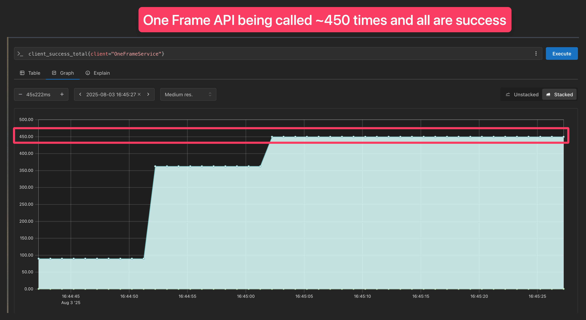

# Dew's version of the `README.md` file

> This is a modified version of the original [README.md](OLD_README.md) file.

# Notes

The codebase will follow [conventional commit](https://www.conventionalcommits.org/en/v1.0.0/). So, both the commit
message and the PR title will follow Semantic convention.

- TL;DR, follow this example `feat: add new feature` for commit message and PR title. and change the prefix based on the
  type of change you made

> - feat: (new feature for the user, not a new feature for build script)
> - fix: (bug fix for the user, not a fix to a build script)
> - docs: (changes to the documentation)
> - style: (formatting; no production code change)
> - refactor: (refactoring production code, eg. renaming a variable)
> - test: (adding missing tests, refactoring tests; no production code change)
> - chore: (updating grunt tasks e.g. update CI/CD, Docker runner, etc; no production code change)

# Overview

> TL;DR, connects to One Frame API to get exchange rate and cache it to Redis with 5 minutes TTL to satisfy
> non-functional requirement of 10,000 successful request per day with oldest 5 minutes data and stored all the secrets
> in HashiCorp Vault.
>
> When service is first run It'll prefetch all the possible exchange rates and store it in Redis cache. using only 1
> call to One Frame API.
>
> To prevent loading vault service, all the token will be cached in memory for 3 hours, this allow user to easily update
> the token without needing to restart the service.
>
> And to make it production ready, all the changes will be covered by tests in CI/CD pipeline to ensure code quality and
> format.
> Tests including unit test to confirm each isolated component, integration/E2E test to ensure feature is running
> correctly end to end
>
> Lastly, to keep high availability and performance, the service will be logged and metrices will be sent to Prometheus.
> We can later, connect data in Prometheus to Grafana to visualize application performance and health.

1. As the requirement is vague, I'll list my assumptions in each task to clarify the scope of the task.
2. Since I don't want to over-complicated the task, I will not try to deploy this code to any cloud provider but rather
   make sure local development and testing is as smooth as possible.
    - Means, all the external dependencies will be deployed locally under single docker-compose file. All the steps to
      start the services will be documented in the `README.md` file.

# Service Feature overview

* If you would like to try it out, please check out how to run the service in [FOREX_MTL_README.md](forex-mtl/README.md)
* All the available endpoints can be found in postman collections/envirnoments [postman](forex-mtl/postman)

| Feature                     | Description                                                                              | Screenshot                                                                                                                                                                                                               |
|-----------------------------|------------------------------------------------------------------------------------------|--------------------------------------------------------------------------------------------------------------------------------------------------------------------------------------------------------------------------|
| Health Check                | Able to check service health                                                             |                                                                                                                                                                |
| Fetch Exchange Rate         | Able to fetch exchange rate from One Frame API                                           |                                                                                                                                                        |
| Error Handling              | Response appropriate error when request query is invalid                                 |                                                                                                                                                          |
| Error Handling              | Response appropriate error when 3rd party service is not available                       |                                                                                                                                                |
| Cache                       | Able to delete the cache either in-memory or Redis                                       |                                                                                                                                                                |
| Monitoring                  | Able to monitor the service success rate and latency in Prometheus                       |                                                                |
| Secret                      | Able to fetch token from HashiCorp Vault                                                 |                                                                                                                                                                              | 
| CI/CD                       | Github pipeline run for code style linting, unit test and coverage, integration/e2e test |                                                              |
| Non-Functional Requirements | Able to handle 10,000 successful requests per day with 5 minutes cache TTL               |    |

# Tasks Breakdown

## [Project Setup](https://github.com/wichayutdew/paidy-assignment/pull/1)

> Trying to understand the project and set up the local environment

- build fresh README.md
- Setup developer environment on both Terminal and IDE
- Familiarize with the sbt commands

## [CI/CD](https://github.com/wichayutdew/paidy-assignment/pull/2)

> Set up the CI/CD pipeline to ensure code quality and have a structured pull request template

- Create GitHun Actions to include build and test

## [Code Quality](https://github.com/wichayutdew/paidy-assignment/pull/3)

> Ensure code is covered by tests and follows the code quality standards

- Add code coverage tool `scoverage` and include it in the CI/CD pipeline with CodeCov
- since `scoverage` transitive dependency is crashing with `scalafmt-coursier`, I decided to use normal `scalafmt`
  instead

## [Handle Errors](https://github.com/wichayutdew/paidy-assignment/pull/5)

> As checked in the original code, the service does not handle errors properly. This is to ensure the API do throws
> appropriate/actionable errors to users when not working as expected

- Implement request parameters validation
    - *Assumption here is the Currency in [Currency.scala](forex-mtl/src/main/scala/forex/domain/Currency.scala) Class
      consists all the valid currencies and nothing more.
- Implement appropriate error handler returns from service level
    - As OneFrame API is still Dummy, the error is not being thrown in service yet.

## [Initiate test framework with Scalatest](https://github.com/wichayutdew/paidy-assignment/pull/5)

> Set up the test framework to ensure the code is covered by tests and add test case to covers existing code

- the test framework is set up with `scalatest` and `mockito-scalatest`

## [Connect to One Frame API](https://github.com/wichayutdew/paidy-assignment/pull/8)

> Implement the live interpreter to connect to the One Frame API to satisfy the functional requirements of getting the
> exchange rate

### Assumptions

1. The requirement doesn't specifically mention the need to hide Forex API endpoint under authentication logic
   > So, I assume the responsibility of Forex service as an information conveyer to Paidy's internal service and leave
   the endpoint open.
   > Since the backend service will usually be hidden behind company's network. and public network will not be able to
   hit it unless we expose it.
   > But if this is a real world I wouldn't assume and probably consult with the team/Product on the nature of the
   service and how would it being utilized.
2. One Frame API response returns more fields than the service expects
   > For me, personally, if the requirement is vague, I would assume that the service signature should remain the same.
   > If there's an extra requirement to expose more fields, it can be done in the future once the requirement is clear.
3. HTTP client to use will be `http4s`
   > Since we develop the http server in this service with http4s, by using client from same library, the code will be
   more consistent and easier to maintain.
   > This prevents any other transitive dependency issues that may arise from using different HTTP client library.
4. OneFrame Token will not be stored in the codebase
   > To keep the codebase clean and secure, I will not store the OneFrame Token in the codebase. within the current
   changes and will be handled in the next task.

## [Move secret to Vault](https://github.com/wichayutdew/paidy-assignment/pull/9)

> Proper way to deals with secrets and keep codebase secure is to saved it to secret manager.
>
> But as we're not deploying this to any cloud provider, we don't get to use any services provided by cloud provider.
>
> I will use local [HashiCorp Vault](https://www.vaultproject.io/) to store all the secrets instead.
>
> And as Scala doesn't have stable native library to connect to Vault, I'll utilize one of the JVM languages perks "
> using Java library".

### Assumptions

1. As vault usually holds long-lived token, it's a good idea to cache the token in memory
   > I don't consider caching it in Redis since it's too risky to pass token through another network hop risking it to
   be compromised
   > As the nature of cloud deployment we do containerized the service and split it into multiple pods, this means each
   pod will need to fetch the token from vault separately, without a cache, that's mean we multiply external calls by 2
   every time we hit OneframeAPI.
   > And also nature of vault service, it's not designed to bear heavy loads, so caching the token in memory help
   relieve the load and still keeps the token secure.
   > Another point secret rotation is not done that frequently and once the secret rotates, we usually have a grace
   period where the old token is still valid while we are migrating to new one.
   > We can set up a cache ttl to be in hours fashion and reduce the load even further, and with help of CI/CD, we will
   also do deployment quite often, this will also help refresh the memory cache as well.

## [Build Redis External Cache](https://github.com/wichayutdew/paidy-assignment/pull/10)

> Implement the Redis external cache to extends to satisfy non-functional requirements of 10,000 successful requests
> with not more than 5 minutes rate per day

### Assumptions

1. One Frame API allows to fetch multiple exchange rates in a single request, So, I will boot a service by filling Redis
   cache with all possible pairs since it would only consume 1 request to One Frame API
   > As from my observation from the API response, rates for pair opposite pair is not the same as the original pair
   > For example, if I request `USD` to `JPY`, the rate is not the same as `JPY` to `USD`. So total from allowed 9
   Currencies there will be 36*2 = 72 possible pairs.
   > With this cache preparation, for first 5 minutes, after the service is booted, we will be able to save multiple
   requests to One Frame API.
2. Initially thought of refreshing entire cache on every api call but decide not to implement.
   > At first, I thought of refreshing all the rates cacehe on every API call.
   > But then I realized that on a production environment, the respone time on One Frame API might be worse if we fetch
   all the 72 pairs at once.
   > That's why I decide to not implement it and just fetch only the requested pair to keep latency low.
   >
   > But thing will change if we are able to get to know logic behind One Frame API and turns our fetching all the rates
   at once wouldn't increase the latency by a lot.
   > In that case, this will benefit the Forex service's latency by a lot.
3. Fetch Redis token (password) once during service's startup
   > As redis token (password) is required during client creation, unlike One Frame API token where it's needs during
   API call.

### Caveat

1. Assume that the requirements of 10,000 successful requests per day will not span too long in a period, otherwise this
   requirement will not be possible to satisfy.
   > e.g. if the requirements are span over 24 hours with very low traffic, the 5 minutes cache will be expired before
   next call invoked, this result in another OneFrame API call.
   > and let's say this happen for over 1,000 times, we will eventually hit their rate limit.
   >
   > In this case, if it's an actual production service, I would either suggest to connect with OneFrame and ask them to
   raise their rate limit, e.g. into 100 requests per minute, etc. th prevent this issue.
   > Or we consult with product team whether how up to date the rate should be, if we can adjust it to be longer, the
   rate limiting issue should not be that severe.
   >
   > But anyway, before we reach that point, we need to at least have some supporting data to show that it's not
   physically possible to satisfy the requirement. That's leads to the next 2 task that I'll implement. Prometheus

## [Build Integration/E2E Tests](https://github.com/wichayutdew/paidy-assignment/pull/12)

> To ensure the service connects to the One Frame API, Vault, and Redis external cache correctly
> and returns result as expected.

- Create integration test stack using docker-compose container to run Forex app, One Frame API, Vault, and Redis.
  And use Scalatest to try hit to /rates endpoint to ensure all the scenarios

### Caveat

1. cannot do healthcheck while spinning up One Frame API due to lacks of healthcheck endpoint

### Assumptions

1. We rely a lot on circe encoder/decoder to do serialization of OneFrame API response and Redis caching.
   > This might ends up in failure loop in case OneFrame API decides to change their response format or Redis somehow
   saving cache in wrong format.
   > Unit/Integration/E2E test will at least confirm that the 2nd scenario where redis is not saving cache correctly
   will not be happening.
   > But anyway we cannot really do fool-proofing against the first scenario, so we will just have to monitor the
   service and fix it when it happens.

## [Send a server metric to Prometheus](https://github.com/wichayutdew/paidy-assignment/pull/13)

> To have a monitoring system to monitor the service's non-functional requirements

- All the logs implemented will all be actionable, in a way that if the service is not working as expected, we
  can see it in the logs and take action to fix it.
- Metrics will be categorized into 3 categories
    - number of calls for both successful and failed requests
        - To verify the non-functional requirements of 10,000 successful requests per day.
        - Can be extended to build Success rate metric
    - cache hit/miss rate
        - To monitor if the cache is working as expected, and also to monitor the
          cache hit/miss rate so we can adjust the cache TTL accordingly.
    - Method's execution time
        - To monitor the performance of the service. can be extended to build latency metric
- All this metrics will also be useful for alert set up along with canary deployment to ensure the service
  is healthy and all the bad packages don't get deployed to production.

### Caveat

1. Will not implement log,metrics appender and tracing

- This will be beneficial for production service, in order to monitor service's health and performance and trying to
  find the hotspot where CPU and Memory not properly utilized. Since we will not deploy the service and the service is
  rather small there's no need to implement it from the stated scope.

## [Load test](https://github.com/wichayutdew/paidy-assignment/pull/14)

> To ensure the service can handle 10,000 successful requests per day, I decided to create new scala test class
> called [LoadTestSpec](forex-mtl/src/testFixture/scala/forex/LoadTestSpec.scala) which will calls to /rates endpoint
> 10,000 times with random pair of currencies and random chance for cache to be evicted to replicate real world
> scenario, otherwise it'll use all the cached data in 1st prefetch during service startup. and OneFrame API will be
> called only once.
>
> As test is just a way for me to ensure that I satisfy the non-functional requirements of 10,000 successful requests
> per day, I will not implement any run process in SBT but rather run it manually in the IDE.

## [Optional] Code Refactoring/Cleanup

> In case there is any code that can be improved or cleaned up

1. convert returned timestamp to be in server timezone
   > this will be helpful for internal service within company in same DC to avoid timezone conversion issues
2. Hide sensitive error message from user
   > Error messages is often hold sensitive information, exposing it as-is in HTTP layer is not a good practice.
3. Create cache invalidate endpoint
   > This is to allow internal user to invalidate the cache easily in case we need to promptly update the token from
   vault, or there's some wrong exchange data.
   >
   > Decided not to implement the authentication header for this due to same assumption as the service's goal to run in
   internal cloud network.
   So, only authorized user within the company can actually hit the endpoint, and there's no impact when the endpoint is
   called accidentally other than the cache is evicted.
4. Handle One Frame API rate limit `Ok:{"error": "Quota reached"}`
   > Even thought the ratelimit error should usually respond with 429:TooManyRequests message but One Frame API decided
   to respond with 200:Ok and error message in the body.

### Rejected Idea(s)

1. convert All Errors to SingleGenericServerError so we don't need to handle error transformation in every service
   > against the functional programming paradigm, decided to not implement it
2. make generic HTTP client and Server Route
   > will not implement since the usage is still focused solely on 1 endpoint with 1 use case of client
   > usually generalization will be useful when we have 2 or more services/clients that working somewhat similar
   > So we try to generalize the logic to be reusable.
3. Swagger documentation
   > Decided not to implement as part of this exercise. Try to research around, the usual library people uses to
   generate the swagger json and ui is Tapir which requires cats 3.x.x, reckon, it'll take too long compared to
   the benefit it gives since the service is rather small, if it's really a production use case and the service is
   utilized internally within the company, documenting the API spec in some wiki page should be sufficient. But if the
   service grows, we can consider upgrading to cats 3.x.x and implement it later.
